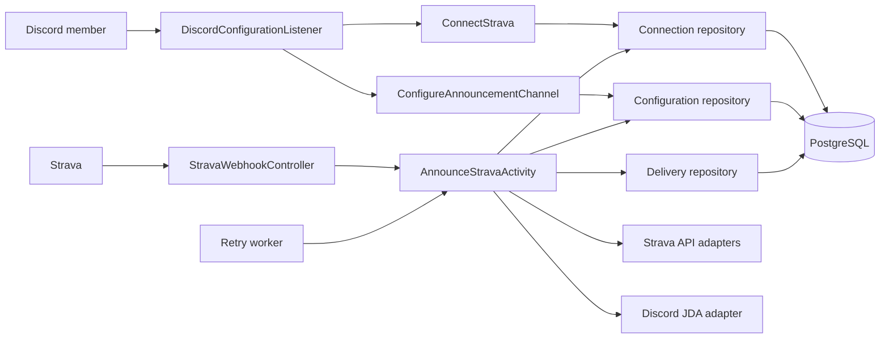
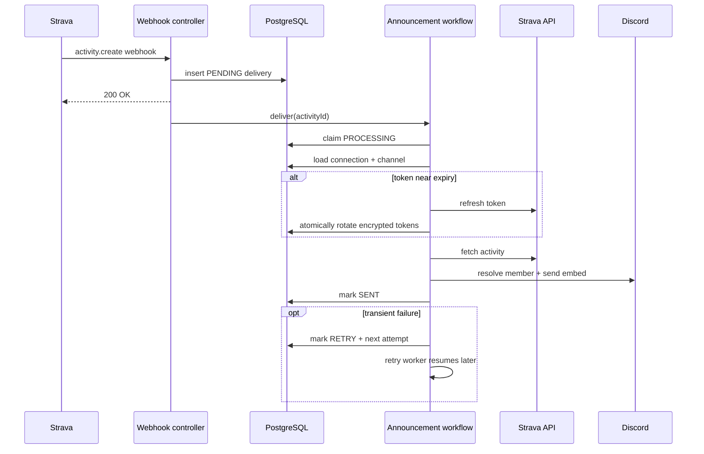
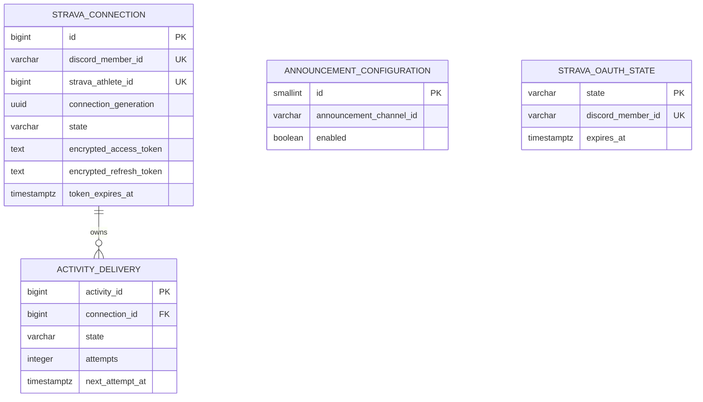

# Overview

## Purpose

This repository runs a single-server Discord bot that connects Discord members to Strava, receives completed-activity webhooks, and posts activity summaries into one configured Discord channel. It keeps OAuth links, channel configuration, and delivery attempts in PostgreSQL so restarts do not lose work.

## Stack

- Java 21, Gradle, Spring Boot 3.4
- Spring MVC for OAuth, webhook, and health endpoints
- JDA 5 for Discord Gateway commands and outbound messages
- PostgreSQL via JDBC/HikariCP; Flyway owns schema migrations
- Java executors for bounded command work, webhook delivery, and scheduled retries
- Multi-stage Docker image deployed as one always-on Fly.io machine
- JUnit 5, AssertJ, Mockito, and Testcontainers

## Structure

```text
.
├── src/main/java/com/discordstrava
│   ├── activity/       activity ingestion, durable delivery, Strava fetch, Discord send
│   ├── configuration/  announcement-channel rules and persistence
│   ├── connection/     OAuth linking, encrypted tokens, refresh, unlinking
│   ├── discord/        slash-command listener and responses
│   ├── runtime/        dependency wiring, environment, database, JDA startup
│   └── web/            health, OAuth callback, Strava webhook controllers
├── src/main/resources
│   ├── application.properties
│   └── db/migration/   ordered PostgreSQL schema migrations
├── src/test/java/      unit and PostgreSQL integration tests, mirroring production packages
├── wayfinder/          product map, research, and historical implementation tickets
├── Dockerfile          Java build stage plus minimal JRE runtime
├── fly.toml            Fly.io machine, HTTPS service, and health-check configuration
└── build.gradle        dependencies, Java toolchain, and test configuration
```

## Main modules

- **RuntimeConfiguration** — composition root. Creates database, repositories, workflows, executors, HTTP clients, and JDA; depends on validated environment settings.
- **DiscordConfigurationListener** — handles `/help`, `/connect`, `/status`, `/unlink`, and `/configure`; delegates business rules to connection/configuration workflows.
- **ConnectStrava** — creates OAuth state, exchanges authorization codes, encrypts tokens, reports status, and performs safe unlinking.
- **StravaWebhookController** — validates the event shape/subscription, persists a delivery claim, acknowledges Strava quickly, then dispatches processing.
- **AnnounceStravaActivity** — central delivery workflow. Resolves connection/configuration, refreshes tokens, fetches the activity, sends Discord output, and records the outcome.
- **ActivityDeliveryRetryWorker** — polls due or abandoned deliveries every minute and resumes them with bounded backoff.
- **JDBC repositories** — narrow persistence adapters for configuration, connections, OAuth state, and delivery state.
- **HTTP/JDA adapters** — isolate external Strava OAuth/API calls and Discord member/channel/message operations.



## Data flow

The main path is deliberately split at durable persistence: webhook receipt claims the activity in PostgreSQL before returning `200`; external API work happens afterward. A crash therefore leaves recoverable state rather than losing the event.



OAuth is a second path: `/connect` creates short-lived state, the browser authorizes at Strava, `/oauth/strava/callback` consumes the state once, and encrypted access/refresh tokens are stored against the Discord member and Strava athlete.

The database model is small:



## Where to start

- Change activity delivery behavior: `activity/AnnounceStravaActivity.java` and its unit test.
- Change Strava authorization/token handling: `connection/ConnectStrava.java`, `HttpStravaOAuthClient.java`, and `HttpStravaTokenRefresher.java`.
- Change slash commands: `discord/DiscordConfigurationListener.java`.
- Change webhook/API behavior: `web/`, then trace into the injected workflow.
- Change persistence: repository interface + JDBC adapter + a new numbered Flyway migration.
- Change startup/deployment: `runtime/RuntimeConfiguration.java`, `Dockerfile`, and `fly.toml`.

## Notes & gaps

- This is a modular monolith: package boundaries are architectural conventions, not separately deployed services.
- Delivery is durable but uses an in-process scheduler, not an external queue. PostgreSQL is both state store and work queue.
- OAuth tokens are encrypted at rest; changing the encryption key without migration makes stored tokens unreadable.
- Integration tests require Docker. No repository CI workflow is present.
- `README.md` mentions Railway-provided `PORT`, while the checked-in deployment is Fly.io with fixed internal port `8080`; current code/config follows Fly.io.
